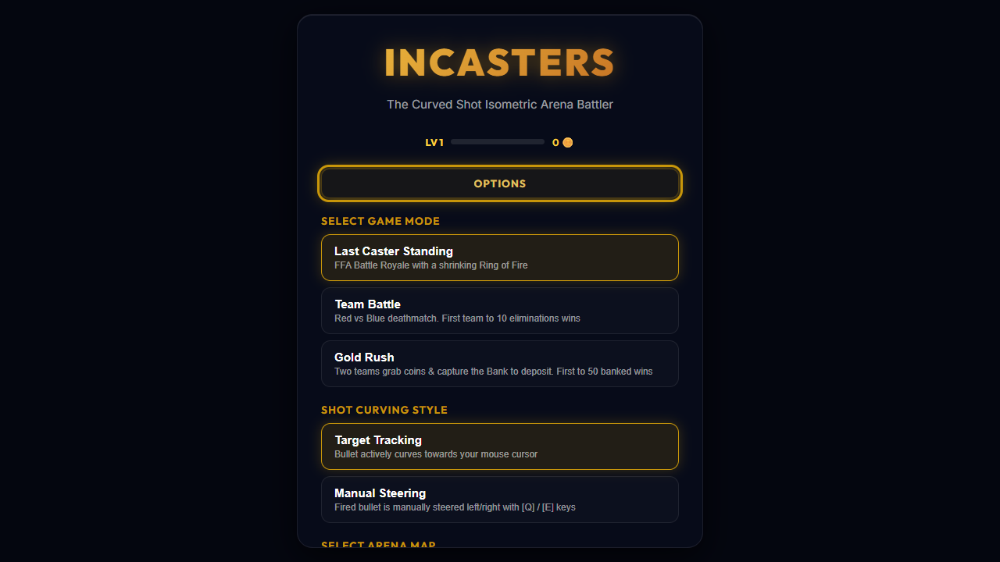
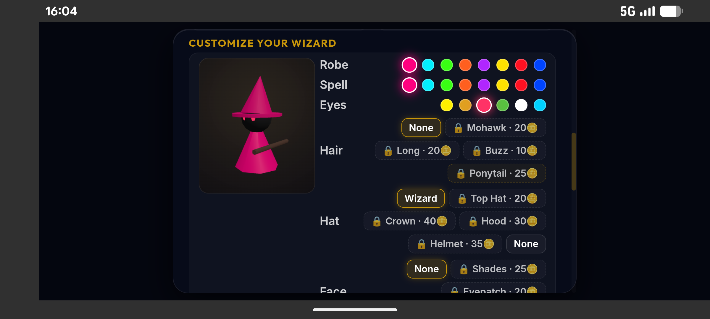
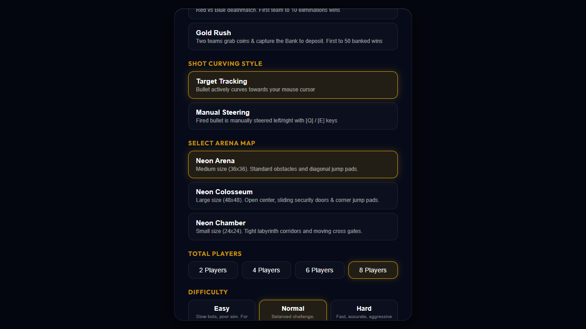
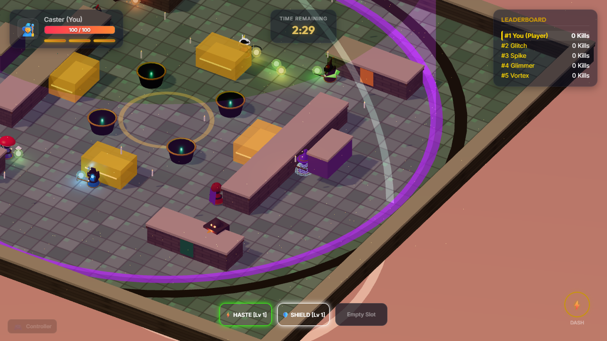
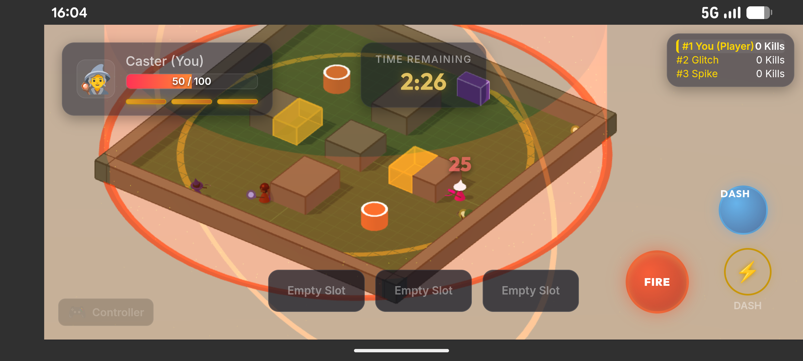
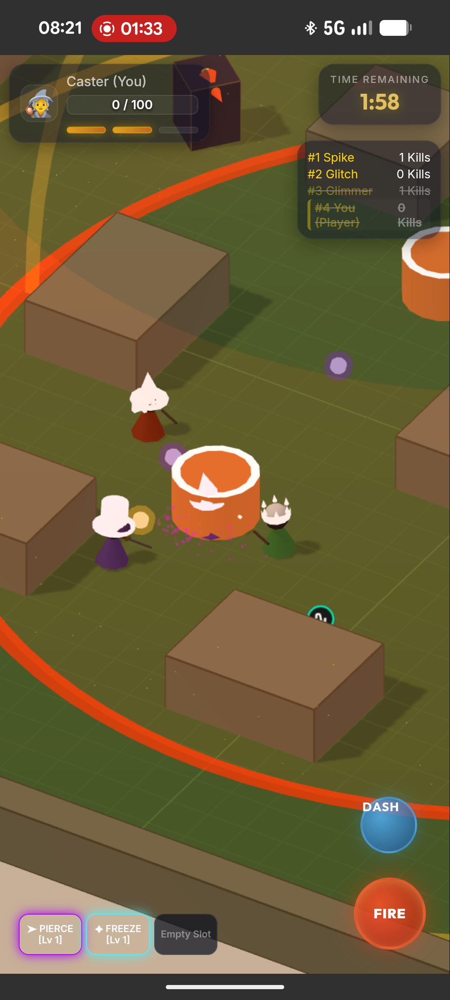

# 🧙‍♂️ Incasters

[](https://github.com/BjornBrorsson/Incasters/actions/workflows/build-apk.yml)
[](https://incasters.web.app)
[](https://opensource.org/licenses/MIT)
[](https://www.typescriptlang.org/)
[](https://threejs.org/)
[](https://capacitorjs.com/)

> **Incasters** is a fast-paced isometric arena battler and curved-shot shooter inspired by the trick-shot combat of *Outcasters*. Battle against bots, local friends over LAN, or online players worldwide using serverless WebRTC room codes!
>
> [](https://incasters.web.app)  
> *Instant play with full touch, gamepad, and mouse+keyboard support — Try it out! Or download a local build, for Windows or Android from the Github Releases*

---

## 📸 Screenshots

### Desktop & UI
| Main Menu | Character Customizer | Match Setup |
| :---: | :---: | :---: |
|  |  |  |

### Gameplay & Combat
| Desktop 3D Battle | Mobile Landscape Combat | Mobile Portrait Gameplay |
| :---: | :---: | :---: |
|  |  |  |

---

## ✨ Features

### 🔮 Dynamic Curved-Shot Mechanics
- **Mid-Air Projectile Steering:** Bend and curve fireballs around corners and solid obstacles in real-time.
- **3D Trajectory Aim Guide:** Glowing laser guide and landing reticle projected onto the 3D ground.
- **Smart Aim Assist:** Gentle magnetic lock for smooth, responsive twin-stick combat on mobile and gamepads.

### 🎮 Game Modes
- 👑 **Battle Royale (Last Caster Standing):** Outlast all other wizards as the shrinking *Octarine* Arcane Seal closes in.
- ⚔️ **Team Battle (4v4 TDM):** Collegiate deathmatch (Scarlet vs. Sapphire houses); first to 10 kills wins.
- 🪙 **Gold Rush:** Collect glowing gold Galleons across the courtyard and deposit them into the ancient Bank Vault.
- 👁️ **Instant Elimination & Spectator Mode:** Dying early immediately presents your final rank and rewards, with options to instantly play again or smoothly spectate surviving bots.

### 🏰 Whimsical Gothic Academy Arenas (5 Unique Maps)
- **5 Thematic Interactive Maps:**
  - 🏰 *Unseen Courtyard* (Weathered cobblestones, floating enchanted candles & house banners)
  - ⚔️ *Dueling Amphitheater* (Open sand arena ring, sliding portcullis gates & corner jump pads)
  - 📚 *Forbidden Arcanum* (Aged mahogany parquet tiles, moving bookcase partitions & power vaults)
  - 🌌 *Astral Observatory* (Obsidian starfield floor, rotating astrolabe prism mirrors & instant warp star gates)
  - 🧪 *Alchemist's Undercroft* (Mossy dungeon flagstones, volatile potion vats & ricochet bounce corridors)
- **Interactive Hazards & Gimmicks:** Bubbling potion cauldrons for high-bounce launches, runic jump dials, sliding portcullis gates, rotating shooting statues, and astrolabe reflective prisms.

### 🎭 Deep Character Customization & Distinct Bot Archetypes
- **11 Head Gear Styles:** Archchancellor Wizard Hat, Headmaster Top Hat, Champion Crown, Cowl Hood, Dragon Helm, Toadstool Fairy Cap, Lunar Crescent Tiara, Jester Bells, Arcane Turban, Shinobi Bandana, or None.
- **8 Weapon Styles:** Gnarled Elder Oak Staff, 11-inch Dueling Wand, Silver Rapier, Astral Scythe, Open Grimoire Focus, Orb Sceptre, Mystic Energy Bow, and Witch's Broom.
- **9 Back Accessories:** Dragon Wings, Velvet Cape, Spell Grimoire, House Banner, Flowing Scarf, Potion Flask Bandolier, Aegis Roundshield, and Hovering Spirit Familiar.
- **9 Face Gear Styles:** Shades, Eyepatch, Wizard Beard, Dueling Mask, Brass Monocle, Runic Forehead Mark, Mystic Blindfold, and Curled Mustache.
- **Guaranteed Distinct Casters:** Every bot match curates unique combinations of robes, hats, weapons, and accessories so no two casters ever share the same silhouette or colors.

### ⚡ Crystal-Clear Power-Up Badges & Upgrades
- High-contrast in-game 3D badges and HUD indicators with unmistakable custom graphical icons and bold name pills (`BOUNCE`, `SPLIT`, `PIERCE`, `HASTE`, `SHIELD`, `FREEZE`, `WALL-RUN`) so players instantly know what to grab from across the arena.

### 🌐 Serverless Online (P2P) & LAN Multiplayer
- **Serverless WebRTC P2P:** Instant room creation with shareable 4-letter room codes (`CAST-XXXX`) and direct invite links (`?room=CODE`).
- **LAN WebSocket Server:** Dedicated local network server (`server/lan-server.js`) for low-latency LAN parties.
- **Host-Authoritative Sync:** Full 3D physics simulation broadcast at 20–30 Hz with client-side interpolation.

### 🛠️ Mario Maker-Style Challenge Editor & Stadia State Share
- **3D Isometric Level Editor:** Build custom Trickshot Trials, obstacles, portals, moving walls, fire hazards, and powerups with 3D raycasting and grid snapping.
- **"Clear Check" Verification:** Creators must successfully beat their own level from start to finish before sharing is unlocked.
- **Zero-Backend State Share Links:** Share challenges or custom multiplayer arenas as compact URL-safe Base64 links (`#share=...`) or 6-letter short codes (`ST-XXXX`).
- **Instant State Re-Creation:** Anyone opening a State Share link can immediately play the challenge, host it in multiplayer lobbies, or remix it in the editor.

### ⚡ Power-Up Stacking System
Combine and stack multiple spells to create wild projectile builds:
- 💥 **Split:** Breaks your shot into a multi-projectile spread fan.
- 🔁 **Bounce:** Projectiles ricochet off walls and obstacles.
- 🎯 **Pierce:** Punches straight through enemy casters.
- 🏃 **Haste:** Drastically increases spell velocity and fire rate.
- 🛡️ **Shield:** Summons an arcane energy sphere to absorb incoming damage.
- ❄️ **Freeze:** Chills targets on impact, slowing their movement speed.
- 🌀 **Wall-Run:** Fireballs hug and glide along perimeter walls.

### 🎨 7-Part Wizard Customizer
Customize your caster with real-time 3D preview in the main menu:
- **Expressive Pokémon-Style Eyes:** Animated pupils, natural blinking, and duel-focused squints.
- **Hats & Headgear:** Floppy star-embroidered Archchancellor hat, Scholar top hat with quill, Dueling Cowl, Crown, and Helm.
- **Wands & Weapons:** 11-inch Ollivanders wand with spark tip, gnarled elder oak staff with hovering Octarine crystal, silver rapier, and scythe.
- **Robes & Accessories:** Conical velvet robes with gold embroidered hem, floating leather grimoires, scholastic velvet capes, and fairy/dragon wings.

### 🤖 Adaptive AI & Bot Difficulty
Four difficulty presets that tune aim error, prediction, dodging reflexes, and power-up hunting:
- **Easy** (Relaxed practice)
- **Normal** (Balanced casual play)
- **Hard** (Competitive dodging & shot curving)
- **Insane** (Relentless flanking & near-instant reflexes)

---

## 🕹️ Controls

| Action | Keyboard & Mouse | Gamepad / Controller | Mobile Touch |
| :--- | :--- | :--- | :--- |
| **Move** | `W` `A` `S` `D` / Arrow Keys | Left Analog Stick / D-Pad | Left Virtual Joystick |
| **Aim** | Mouse Cursor | Right Analog Stick | Right Virtual Joystick |
| **Cast Spell** | Left Mouse Click | `RT` / `LT` / `A` Button | Dedicated Fire Button / Right Stick Drag |
| **Curve Shot** | Move Cursor / `Q` `E` | Right Stick Direction | Drag Right Stick |
| **Dodge Dash** | `Spacebar` | `B` Button / `RB` / `LB` | Dedicated Dash Button / Dash Circle |

---

## 🛠️ Tech Stack & Architecture

- **Rendering Engine:** [Three.js](https://threejs.org/) (Custom shaderless low-poly meshes, Orthographic Isometric camera, particle systems, dynamic shadows).
- **Language & Tooling:** TypeScript 5, Vite 8, CSS3 glassmorphism.
- **Physics Engine:** Custom 2D simulation layer with isometric 3D projection (`Physics.ts`), Circle-vs-Circle and Circle-vs-AABB intersections.
- **Mobile Shell:** [Capacitor](https://capacitorjs.com/) for native Android packaging.
- **Desktop Shell:** [Electron](https://www.electronjs.org/) for the portable Windows build.
- **Automated Testing:** Headless E2E gametest suite using [Puppeteer Core](https://pptr.dev/).
- **CI/CD & Hosting:** Parallel GitHub Actions builds publish the Windows EXE, Android APK, and offline Web bundle to the GitHub Release, and automatically deploy the web client live to [Firebase Hosting](https://incasters.web.app).

---

## 🚀 Getting Started

### Prerequisites
- [Node.js](https://nodejs.org/) (version 22 or higher recommended)
- [npm](https://www.npmjs.com/)

### 1. Installation
```bash
git clone https://github.com/BjornBrorsson/Incasters.git
cd Incasters
npm install
```

### 2. Run Local Development Server
```bash
npm run dev
```
Open your browser at `http://localhost:5173/` to start playing immediately.

### 3. Production Web Build & Firebase Deploy
```bash
# Build production web bundle to dist/
npm run build
npm run preview

# Deploy manually to Firebase Hosting
npm run deploy:hosting
```

### 4. Run the LAN Multiplayer Server
```bash
npm run lan-server
```
Starts the local WebSocket game host on port `7070`.

### 5. Automated E2E Gametests
Run the headless game simulation to verify the render loop, HUD, menus, and bot AI:
```bash
node test-game.js
```

---

## 📦 Android, Windows & Firebase Release Builds

The repository includes an automated GitHub Actions CI/CD workflow that compiles and publishes the **Android APK**, the **Windows portable EXE**, and the **Web Distribution ZIP** to the same GitHub Release on every push to `main` or tag creation, while automatically deploying the live web build to **Firebase Hosting**.

### Download Prebuilt Binaries

1. Visit the [Releases](https://github.com/BjornBrorsson/Incasters/releases) page.
2. Pick the latest release.
3. Download the assets you need:
   - `Incasters-Android.apk` — install on any Android device.
   - `Incasters-Windows-x64.exe` — portable Windows x64 executable; no installation required.
   - `Incasters-Web.zip` — static web bundle for offline play or custom web hosting.
   - Or play directly online at [https://incasters.web.app](https://incasters.web.app).

> **Windows SmartScreen note:** The Windows build is currently unsigned, so Windows Defender / SmartScreen may show a warning the first time you run it. Choose **More info → Run anyway** to start the game.

### Build Windows Locally

To produce the portable Windows executable on your own machine:

```bash
npm install
npm run desktop:build
```

The output file is created at `release/windows/Incasters-0.0.0-Windows-x64.exe` and can be run directly or renamed to `Incasters-Windows-x64.exe`.

### Build Android Locally

```bash
# 1. Build web distribution
npm run build

# 2. Sync web assets with Capacitor
npx cap sync android

# 3. Compile debug APK using Gradle
cd android
./gradlew assembleDebug
```

The output APK will be generated at `android/app/build/outputs/apk/debug/app-debug.apk`.

---

## 📂 Project Structure

```
Incasters/
├── .github/workflows/    # CI/CD GitHub Actions APK build workflow
├── android/              # Native Android wrapper project (Capacitor)
├── server/
│   └── lan-server.js     # Standalone WebSocket LAN multiplayer server
├── src/
│   ├── engine/
│   │   ├── AimVisualizer.ts # 3D Trajectory guide & ground reticle
│   │   ├── Audio.ts         # Web Audio synthesizer SFX & BGM
│   │   ├── Fx.ts            # Floating damage numbers, kill-feed & announcer
│   │   ├── Game.ts          # Core tick loop, camera follow, and entity manager
│   │   ├── InputManager.ts  # Keyboard, mouse & gamepad polling
│   │   ├── Physics.ts       # Circle/AABB collisions & isometric transforms
│   │   └── Theme.ts         # Sky dome & neon palette definitions
│   ├── entities/
│   │   ├── Bot.ts           # AI controller (dodging, aiming, curving)
│   │   ├── Caster.ts        # Wizard avatar meshes, robes, hats & weapons
│   │   ├── Entity.ts        # Base physics entity
│   │   ├── PowerUp.ts       # Pickups (Shield, Freeze, Bounce, Split, etc.)
│   │   └── Projectile.ts    # Flying spell physics & wall-running glide
│   ├── game/
│   │   ├── CharacterConfig.ts # 7-part customization presets & options
│   │   ├── Difficulty.ts      # Bot AI difficulty configurations
│   │   └── Progression.ts     # XP, levels, challenges & shop persistence
│   ├── net/
│   │   └── LanClient.ts     # WebSocket network client & state renderer
│   ├── world/
│   │   ├── Arena.ts         # Map layouts, doors, bounce pads & spawners
│   │   └── GameModes.ts     # Battle Royale, Team Battle, and Gold Rush rules
│   ├── main.ts              # Entry point & menu UI state
│   └── style.css            # Responsive neon glassmorphism stylesheet
├── test-game.js             # Headless E2E Puppeteer gametest
├── index.html               # Main HTML markup & HUD overlays
└── package.json
```

---

## 📜 License

This project is licensed under the MIT License - see the [LICENSE](LICENSE) file for details.
